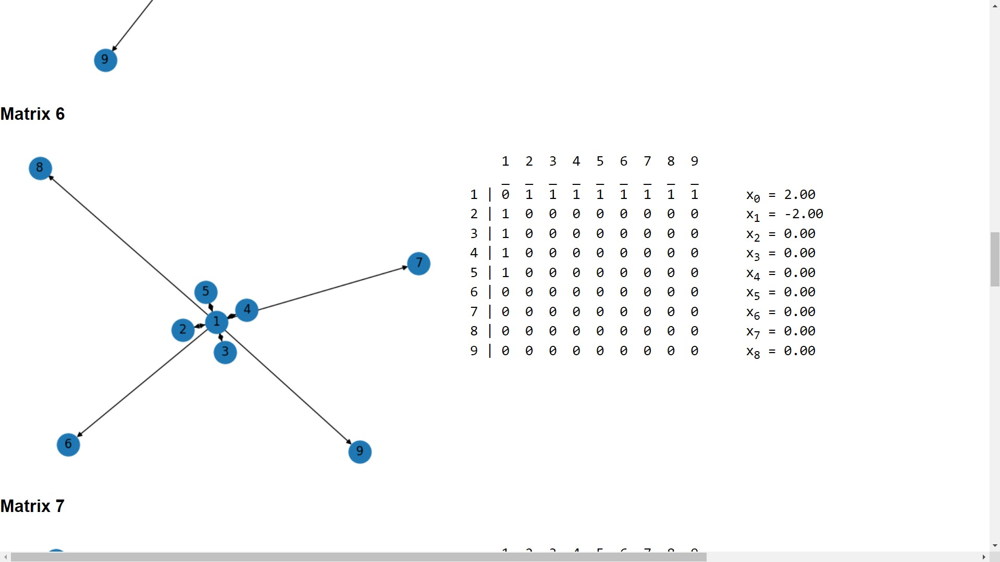

# Demo
Running the commands in the CLI:


Visualizing the graph in the browser:


# Running the Express Server

To run the Express server on your machine, follow the steps below:

1. Make sure you have Node.js installed on your system. You can download it from the official Node.js website.

2. Open a terminal or command prompt and navigate to the project directory.

3. Install the required dependencies by running the following command:

    ```
    npm install
    ```

4. Once the installation is complete, start the server by running the following command:

    ```
    npm run start
    ```

5. The Express server will now be running on your local machine. You can access it by opening a web browser and navigating to `http://localhost:3000`.

# Using the API
Make sure you have Python installed along with all the required libraries. You can install the required libraries by running the following command:

```bash
pip install -r requirements.txt
```

Run the following command to start the Python CLI application for managing your graphs:

```bash
python main.py
```
## CLI Commands
You can now use the CLI to create, visualize, and delete graph adjacency matrices! Currently supported commands include:

- `add <n>` - Add a new graph adjacency matrix. After running this command, you will be prompted to enter `n` rows of space-separated integers to represent the adjacency matrix.
- `delete <matrix number>` - Delete the graph adjacency matrix with the specified number.
- `delete all` - Delete all graph adjacency matrices.
- `exit` - Exit the CLI.
- `power <n> <power>` - Raise the `n x n` matrix to the power of `power`. The output is in the `powers.txt` file.